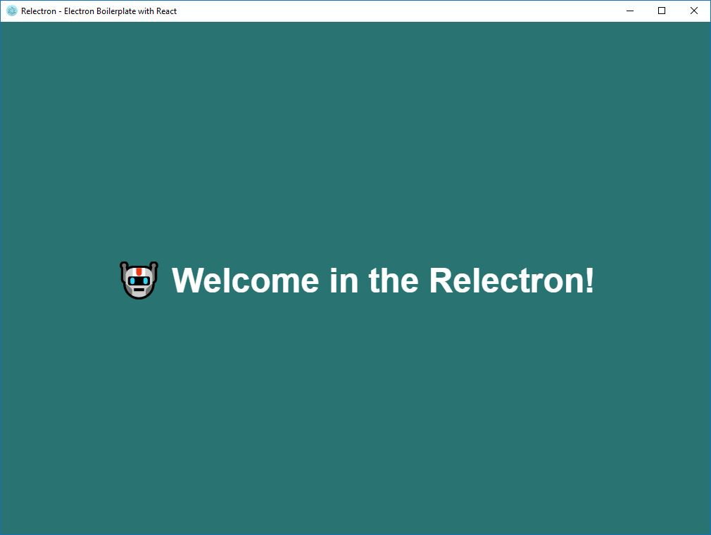

# 🤖 Relectron
Relectron is a lightweight boilerplate to start build your desktop application with React and Electron.

## 🔌 Commands

Install dependencies:
````javascript
npm install or yarn install
````

Start development:
````javascript
npm run start or yarn start
````

Build installer for Windows:
````javascript
npm run build-windows or yarn build-windows
````

Build installer for Linux:
````javascript
npm run build-linux or yarn build-linux
````
You will be able to find your installer (msi or snap) in **dist** folder!



## 🏁 Where can you start?!

The application entry point is the component named **Root**! You can start to develop your application there. After you run ``npm run start`` or ``yarn start`` command, the application will open in development mode. If you change anything inside the Root component, you will see the changes immediately, thanks to the Hot Module Reload.

## 💡 Before you build your installer!
Don't forget to change version, name, author etc.: property in the ``package.json`` before you run the installer build with ``npm run build-windows`` or ``yarn build-windows`` command.


## 🎉 Features
* Use the latest React
* You don't need to configure Webpack
* HMR
* You can use new JS features like Async/Await or class properties