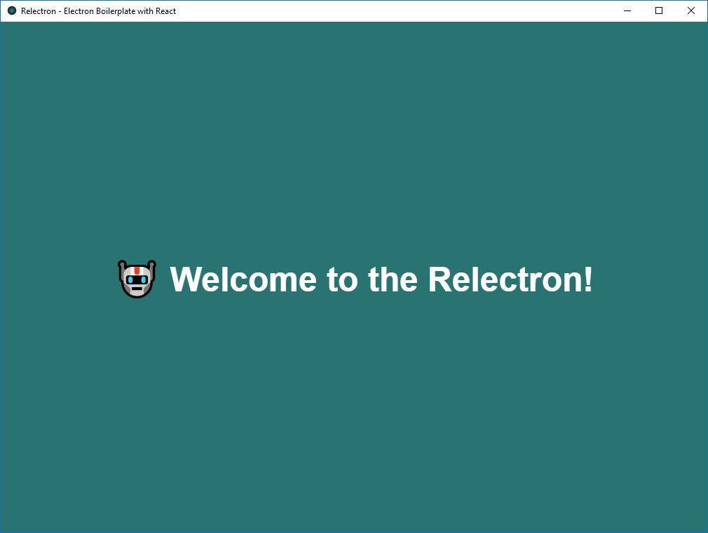

# 🤖 Relectron
This repository is under construction!

## 🔌 Commands

Install dependencies:
````javascript
npm install or yarn install
````

Start development:
````javascript
npm run start or yarn start
````

Build installer for Windows:
````javascript
npm run build-windows or yarn build-windows
````
You will be able to find your installer (msi) in *dist* folder!

